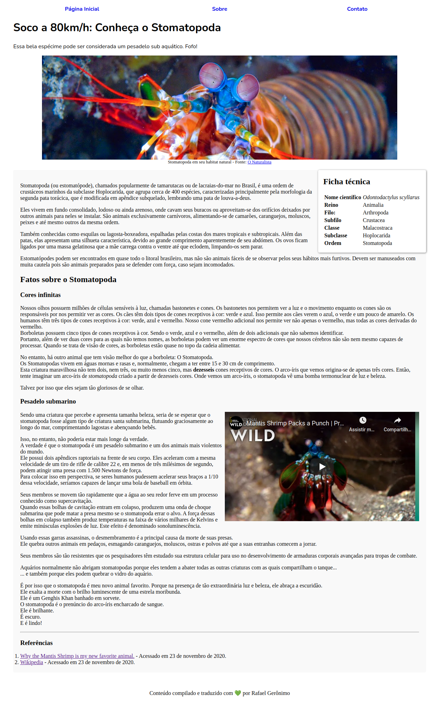

## HTML Semântico

O objetivo desses exercícios é colocar em prática o que aprendemos sobre **HTML semântico**.
Para isso, criaremos uma página que apresenta um dos animais mais impressionantes que existem: o Stomatopoda.

#### Tarefas:
1. Adicione um cabeçalho na página contendo o título `Soco a 80km/h: Conheça o Stomatopoda`.
2. Adicione um conjunto de links que representam a área de navegação do site.
  1. Crie um link chamado `Página Inicial`.
  2. Crie um link chamado `Sobre`.
  3. Crie um link chamado `Contato`.
3. Crie um artigo que vai conter os fatos interessantes sobre o `Stomatopoda`. O artigo terá o subtítulo `Fatos sobre o Stomatopoda`.
4. Divida o artigo em seções, organizando-o da seguinte forma:
  1. Uma primeira seção contendo informações gerais a respeito do animal. O subtitulo para esse seção fica a seu critério. É necessário que conste nessa seção seu nome científico, que é `Odontodactylus scyllarus`, em itálico. Além disso, é preciso que haja informação tabular a respeito de sua classificação científica, em específico: `Reino`, `Filo`, `Subfilo`, `Classe`, `Subclasse` e `Ordem`. Tais informações você consegue obter [na Wikipedia](https://pt.wikipedia.org/wiki/Stomatopoda).
  2. As outras seções dizem respeito aos fatos interessantes que você escolheu acerca do animal. Para cada fato escolhido você vai criar uma seção.
  3. Adicione para cada seção um subtítulo referente ao fato escolhido.
  4. Adicione, para cada seção, parágrafos descrevendo o fato escolhido. Destaque características impressionantes referentes ao fato que você escolheu, de forma a reforçar a unicidade do `Stomatopoda`. Por exemplo: se você criar uma seção detalhando o soco potente do animal, seria interessante destacar a velocidade desse soco (80km/h) em negrito.
  5. Adicione, para cada seção, uma imagem, como forma de ilustrar o fato.
  6. Adicione, por fim, uma seção de referências bibliográficas, contendo uma lista de todos os links que foram usados como base para compilar a página em questão.
5. Adicione um conteúdo adjacente ao artigo, disponibilizando um link para um video que mostra a ação do animal.
6. Adicione uma rodapé na página, mostrando algo do gênero "Conteúdo compilado por...".

*Obs*: Para esse exercício, é obrigatório fazer uso de **no mínimo** elementos com as seguintes tags: `header`, `nav`, `article`, `section`, `h1`, `h2`, `h3`, `aside`, `footer`, `table` e `img`.

### Validando o exercício
Após criar a página mostrando os fatos interessantes a respeito do `Stomatopoda`, suponhamos que uma pessoa com deficiência visual acesse sua página. Será que a sua página é **acessível** para essa pessoa?

Vamos averiguar!

Entre [nesse site](https://achecker.ca/checker/index.php), que valida se sua página é acessível ou não.

### Screenshot do resultado:
